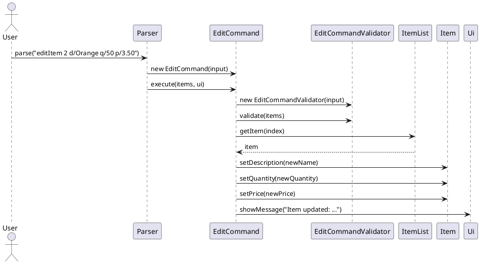

# InventoryBRO - Developer Guide

## Table of Contents
1. [Acknowledgements](#acknowledgements)
2. [Design](#design)
    * [Architecture](#architecture)
    * [UI Component](#ui-component)
    * [Parser Component](#parser-component)
3. [Implementation](#implementation)
    * [Adding an Item](#adding-an-item)
    * [Deleting an Item](#deleting-an-item)
    * [Editing an Item](#editing-an-item)
    * [Finding an Item](#finding-an-item)
    * [Filtering Items](#filtering-items)
    * [Transacting an Item](#transacting-an-item)
    * [Viewing Transaction History](#viewing-transaction-history)
    * [Storage System](#storage-system)
    * [Command Autocompletion (Trie & JLine)](#command-autocompletion)
    * [Typo Detection](#typo-detection)
4. [Proposed/Planned Features](#proposedplanned-features)
    * [Storage & Data Persistence](#storage--data-persistence)

---

## Acknowledgements
* **JLine3**: Used for implementing the interactive terminal, intercepting keystrokes, and providing tab-autocompletion functionality for commands.
* **PlantUML**: Used to generate the UML diagrams in this guide.

---

## Design

### Architecture
The architecture of InventoryBRO strictly adheres to Object-Oriented principles and utilizes the **Command Pattern** to decouple the parsing of user input from the execution of the application's core logic.

The main components are:
* `Ui`: Handles all interactions with the user.
* `Parser`: Interprets input and creates `Command` objects.
* `Command`: Interface implemented by all commands.
* `ItemList` / `Item`: Core data model.
* `Storage`: Handles persistence of inventory and transaction data.

**Figure 1: Overall Architecture / Class Diagram**  


---

### UI Component
The `Ui` class acts as the bridge between the user and the internal logic.

**Figure 2: UI Class Diagram**  


**Design highlights:**
* Detects interactive vs automated mode
* Uses JLine for autocompletion
* Falls back to BufferedReader for testing

---

### Parser Component
The `Parser` is responsible for routing user input to the correct command.

**Figure 3: Parser Class Diagram**  


**Design highlights:**
* Uses switch-based factory pattern
* Integrates TypoDetector for suggestions

---

## Implementation

### Adding an Item

The add mechanism is handled by the `AddCommand` class. It validates the input, creates a new `Item`, and appends it to the inventory.

**Figure 13: Add Command Class Diagram**


**Step-by-step Execution:**
1. The user inputs `addItem d/Apple q/50`.
2. `Parser` matches the `addItem` prefix and instantiates a new `AddCommand` with the raw input string.
3. `Parser` calls `execute(items, ui)` on the `AddCommand`.
4. `AddCommand.execute()` immediately creates a new `AddCommandValidator` and calls `validate(items)`.
5. `AddCommandValidator` applies the regex `^addItem d/(.*?) q/(\d+)$` to the input. If it does not match, it throws `IllegalArgumentException` with `"Invalid addItem format! Use: addItem d/NAME q/INITIAL_QUANTITY"`. If the format is valid, it trims the captured name and delegates to `DuplicateItemValidator`, which iterates the `ItemList` performing a case-insensitive name comparison; a match throws `IllegalArgumentException` with `"An item named '<NAME>' already exists in the inventory."`.
6. If validation passes, `AddCommand` re-applies the same regex to extract the trimmed name and parses the quantity as an integer.
7. A new `Item` is constructed and appended to the `ItemList` via `items.addItem(newItem)`.
8. `ui.showMessage("Added: " + newItem)` confirms the addition to the user.

**Figure 14: Add Command Sequence Diagram**


---

### Deleting an Item

**Figure 15: Delete Command Class Diagram**


**Step-by-step Execution:**
1. When the user inputs `deleteItem 1`, the `Parser` instantiates a new `DeleteCommand` with the raw input string.
2. The `Parser` invokes the `execute(items, ui)` method on the `DeleteCommand`.
3. The `DeleteCommand` immediately creates a `DeleteCommandValidator` and calls `validate(items)`.
4. The `DeleteCommandValidator` uses Regex (`^deleteItem\s+(\d+)$`) to ensure the format is correct. If the format is invalid or the parsed index is out of bounds, it throws an `IllegalArgumentException` which halts execution.
5. If validation passes, `DeleteCommand` calculates the zero-based index and calls `deleteItem()` on the `ItemList`.
6. Finally, a success message containing the removed item's details is passed to the `Ui` to be displayed to the user.

**Figure 16: Delete Command Sequence Diagram**


---

### Editing an Item

The edit mechanism is handled by the `EditCommand` class. It validates the input, then updates an existing item's **description**, **quantity**, and **price** in the inventory, identified by its 1-based list index.

**Figure 16b: Edit Command Class Diagram**


**Step-by-step Execution:**
1. The user inputs a command such as `editItem 2 d/Orange Juice q/50 p/3.50`.
2. `Parser` matches the `editItem` prefix and instantiates a new `EditCommand` with the raw input string.
3. `Parser` calls `execute(items, ui)` on the `EditCommand`.
4. `EditCommand.execute()` immediately creates a new `EditCommandValidator` and calls `validate(items)`. If the format is invalid or the index is out of bounds, an `IllegalArgumentException` is thrown and execution halts.
5. If validation passes, the input string is parsed using a chain of `split()` calls to extract:
   * **INDEX** — the target item's 1-based position, converted to a 0-based index.
   * **NAME** — the new item description (after `d/`).
   * **QUANTITY** — the new quantity as an `int` (after `q/`).
   * **PRICE** — the new price as a `double` (after `p/`).
6. The target `Item` is retrieved from `ItemList` via `items.getItem(index)`.
7. The item's fields are updated in-place via `item.setDescription(newName)`, `item.setQuantity(newQuantity)`, and `item.setPrice(newPrice)`.
8. `ui.showMessage("Item updated: " + item)` confirms the update to the user.

**Figure 16c: Edit Command Sequence Diagram**


The parsing logic extracts each field sequentially:
```java
String[] words = input.split(" ", 2);
// words[0] = "editItem", words[1] = "2 d/Orange q/50 p/3.50"

String[] parts = words[1].split("d/", 2);
int index = Integer.parseInt(parts[0].trim()) - 1;  // 0-based index

String[] descParts = parts[1].split("q/", 2);
String newName = descParts[0].trim();               // "Orange"

String[] quantityParts = descParts[1].split("p/", 2);
int newQuantity = Integer.parseInt(quantityParts[0].trim());   // 50
double newPrice = Double.parseDouble(quantityParts[1].trim()); // 3.50
```

All validation is delegated to `EditCommandValidator` **before** any parsing occurs, keeping `EditCommand` focused purely on execution.

**Design Considerations:**

| Approach | Pros | Cons |
|---|---|---|
| Current: all 3 fields always required | Simple and predictable parsing | User must re-enter all fields even if only one changes |
| Optional fields (`d/`, `q/`, `p/` each optional) | More flexible for the user | More complex parsing and validation logic |

The current design requires all three fields to be provided. If partial edits are desired in a future version, consider regex-based parsing or `Optional<>` wrappers for each field.

---

### Finding an Item

**Figure 17: Find Command Class Diagram**


**Step-by-step Execution:**
1. When the user inputs `findItem keyword`, the `Parser` instantiates a new `FindCommand`.
2. The `Parser` calls `execute(items, ui)` on the command.
3. The `FindCommand` uses a Regex pattern (`^findItem\s+(.+)$`) to extract the search keyword. If the format is invalid, it throws an `IllegalArgumentException`.
4. The command iterates through the `ItemList`, retrieving each `Item` and checking if its description contains the target keyword.
5. Matching items are immediately passed to the `Ui` to be displayed. If no items match by the end of the loop, a "not found" message is displayed instead.

**Figure 18: Find Command Sequence Diagram**


---

### Filtering Items

The filter mechanism is handled by the `FilterCommand` class. It evaluates one or more field-operator-value predicates — joined by `AND` / `OR` — against every item in the inventory and displays all matching results.

**Figure 19: Filter Command Class Diagram**


**Step-by-step Execution:**
1. The user inputs a command such as `filterItem quantity > 10` or `filterItem description = 'Apple' OR quantity < 5`. The `Parser` instantiates a new `FilterCommand` with the raw input string.
2. The `Parser` calls `execute(items, ui)` on the `FilterCommand`.
3. Inside `execute()`, `FilterCommand` immediately creates a `FilterCommandValidator` and calls `validate(items)`.
4. `FilterCommandValidator` first checks that the input starts with `"filterItem "`. It then applies the predicate regex `(description|quantity|price) (=|<|>) ('.*?'|[^\s']+)` to extract all predicate matches and their positions.
5. The validator checks every gap between consecutive matches: the first gap must be empty, each subsequent gap must be exactly `AND` or `OR`, and no trailing text may follow the last predicate. A bad gap throws `IllegalArgumentException` (e.g. `"Expected AND or OR between predicates, found: '...'"` ). It then validates each predicate's value type: `description` values must be single-quoted; `quantity` and `price` values must match `^\d+$`. A type mismatch throws `IllegalArgumentException`.
6. Back in `execute()`, the same regex builds a flat list of `[field, operator, value]` arrays and a corresponding list of joining operators.
7. `buildAndGroups()` splits the flat list into AND-groups: consecutive predicates joined by `AND` stay in the same group; an `OR` starts a new group. This implements AND-before-OR precedence without explicit precedence parsing.
8. `collectMatchingItems()` iterates every `Item` in the `ItemList`. For each item, `passesFilter()` checks whether it satisfies every predicate in at least one AND-group. Within a group, `evaluatePredicate()` resolves each field: `description` uses `String.compareTo`; `quantity` and `price` use `Integer.compare`. The comparator result is tested against `=`, `<`, or `>` by `satisfiesOperator()`.
9. If no items match, `Ui` displays `"No items match the given filter."`. Otherwise it displays `"Here are the filtered items:"` followed by a numbered list of matching items in their original inventory order.

**Figure 20: Filter Command Sequence Diagram**


---

### Transacting an Item

The transact mechanism is handled by the `TransactCommand` class. It updates an item's quantity and records the transaction.

**Figure 21: Transact Command Class Diagram**


**Step-by-step Execution:**
1. User inputs `transact 1 q/-5`
2. `Parser` creates `TransactCommand`
3. `execute()` is called
4. `TransactCommandValidator` validates format and index
5. Input is parsed to extract:
    * target index
    * quantity change
6. `ItemList.getItem(index)` retrieves the item
7. Item quantity is updated
8. `TransactionStorage.saveHistory()` records the transaction
9. UI displays updated quantity

**Figure 22: Transact Command Sequence Diagram**


---

### Viewing Transaction History

The `ShowTransactionHistoryCommand` retrieves and displays all past transactions.

**Figure 23: Show History Class Diagram**


**Step-by-step Execution:**
1. User inputs `showHistory`
2. `Parser` creates the command
3. Validator checks correct usage
4. `TransactionStorage.load()` retrieves all entries
5. If empty → show message
6. Otherwise → iterate and print all entries

**Figure 24: Show History Sequence Diagram**


---

### Storage System

The storage system is responsible for persisting both inventory data and transaction history.

**Figure 25: Storage Class Diagram**


**Design breakdown:**

* **Storage (Abstract Class)**
    * Provides generic file handling
    * Defines `saveArray`, `saveHistory`, and `load`

* **ArrayStorage**
    * Handles `ItemList`
    * Converts between `Item` and string format

* **TransactionStorage**
    * Stores transaction history as strings
    * Automatically generates timestamps

**Key Design Decisions:**
* Use of generics (`Storage<T>`) for reusability
* Separation of inventory and transaction files
* Append-only strategy for transaction history

---

### Command Autocompletion

The autocompletion mechanism is handled by the `Autocompleter` class, which wraps a `Trie` data structure and integrates with JLine's completer API to provide real-time tab-completion of command keywords in interactive terminal sessions.

**Figure 26: Autocompleter Class Diagram**


**Step-by-step Execution:**

**Initialisation:**
1. `Ui` is constructed and immediately instantiates a new `Autocompleter`.
2. `Autocompleter`'s constructor calls `buildTrie()`, which creates a new `Trie` (and its root `TrieNode`).
3. `buildTrie()` iterates over every value in `CommandWord.values()` and calls `trie.insert(cmd.getWord())` for each keyword.
4. `Trie.insert()` traverses the trie character by character (lowercased), calling `getOrCreateChild(ch)` on each `TrieNode`. At the terminal node it calls `setKeyword(word)` to store the original-cased keyword, marking that node as an end-of-word.
5. After construction, `Autocompleter` holds a fully populated `Trie` that can answer prefix-match queries for all known command words.

**Tab-completion (user presses Tab):**
1. JLine detects the Tab keystroke and invokes `Ui.complete(reader, line, candidates)`.
2. `Ui.complete()` checks `line.wordIndex() == 0`; if the cursor is not on the first word, it returns immediately (no completion for arguments).
3. `Ui.complete()` calls `autocompleter.getMatches(line.word())`, passing the current partial word as the prefix.
4. `Autocompleter.getMatches()` delegates to `trie.findWithPrefix(prefix)`.
5. `Trie.findWithPrefix()` calls `navigateTo(prefix.toLowerCase())` to walk down the trie to the node corresponding to the prefix. If no such node exists, an empty list is returned.
6. Starting from the prefix node, `collectWords()` recursively visits every descendant node. Any node where `isEndOfWord()` is true contributes its stored keyword to the result list.
7. The list of matching keywords is returned to `Ui.complete()`, which wraps each keyword in a `Candidate` object and adds it to JLine's `candidates` list.
8. JLine displays the candidates to the user in the terminal (inline if only one match, or as a menu if multiple).

**Figure 27: Autocompleter Sequence Diagram**


---

### Typo Detection

When a user enters an unknown command, InventoryBRO attempts to detect whether it is a near-miss typo and suggests the closest known command.

**Figure 28: Typo Detector Class Diagram**


**Step-by-step Execution:**
1. The user inputs an unrecognised command (e.g. `adItem d/Apple q/5`).
2. `Parser.parseCommand()` evaluates the first word against all known command keywords in the switch statement and returns `null` because no branch matches.
3. `Parser.parse()` detects the `null` result and calls `handleUnknownCommand(line, ui)`.
4. `handleUnknownCommand()` extracts the first word from the raw input and calls `TYPO_DETECTOR.findClosestMatch(firstWord)`.
5. `TypoDetector.findClosestMatch()` converts the input to lowercase and iterates over `KNOWN_COMMANDS` (`addItem`, `deleteItem`, `editItem`, `transact`, `listItems`, `help`, `exit`). For each known command it calls `calculateWeightedEditDistance()`, which uses dynamic programming with QWERTY keyboard Manhattan distance as the substitution cost: adjacent keys on the same row cost less than keys far apart, encouraging the algorithm to prefer swaps of physically close keys over arbitrary substitutions.
6. After scoring all commands, `findClosestMatch()` calls `isBelowTypoThreshold()` on the best candidate. The threshold is `TYPO_THRESHOLD_FACTOR (0.2) * max(inputLength, commandLength)`. If the best distance is below this threshold the command name is returned as a non-empty `Optional`; otherwise an empty `Optional` is returned.
7. Back in `handleUnknownCommand()`, if the `Optional` is present, `ui.showMessage("Do you mean " + suggestion + "?")` prompts the user with the suggested correction. If no command qualifies, `ui.showError(...)` displays the full list of valid commands.

**Figure 29: Typo Detector Sequence Diagram**


---

## Product scope

### Target user profile

InventoryBRO is designed for small shop owners (e.g., "BRO") who need a simple and fast way to manage their inventory using a Command Line Interface (CLI).

The target user:

Manages a small-scale retail inventory (e.g., drinks, snacks, convenience items)
Prefers typing commands over using graphical interfaces
Requires quick and precise stock updates during daily operations
Has basic familiarity with using a computer terminal
May not have access to complex inventory management systems

InventoryBRO provides a lightweight and efficient CLI-based inventory management system that allows users to:

Track current stock levels in real time
Quickly update inventory through transactions (sales/restocks)
View and manage all items in a structured list
Record and review transaction history for accountability

Unlike complex enterprise systems, InventoryBRO focuses on:

speed (fast command execution)
simplicity (minimal setup, no GUI overhead)
accuracy (clear, structured output)

---

## User Stories

| Version | As a ...    | I want to ...                                     | So that I can ...                                           |
|---------|-------------|---------------------------------------------------|-------------------------------------------------------------|
| v1.0    | new user    | see usage instructions                            | refer to them when I forget how to use the application      |
| v1.0    | store owner | add items                                         | keep track of new products in my inventory                  |
| v1.0    | store owner | delete items                                      | remove products that are no longer sold                     |
| v1.0    | store owner | edit item details                                 | update product name or quantity when needed                 |
| v1.0    | store owner | view all items                                    | know what products I currently have                         |
| v1.0    | store owner | update item quantity via transactions             | record sales or restocking accurately                       |
| v1.0    | store owner | exit the application                              | safely close the program after use                         |
| v2.0    | store owner | find items by keyword                             | locate items quickly without scanning the full list         |
| v2.0    | store owner | view transaction history                          | review past transactions for tracking and reference         |
| v2.0    | store owner | have my inventory automatically saved             | avoid losing data when I close the application              |
| v2.0    | store owner | load previously saved inventory                   | continue managing my shop from where I left off             |
| v2.0    | store owner | view detailed instructions for a specific command | learn how to use a command correctly                        |

---

## Non-Functional Requirements

{Give non-functional requirements}

---

## Glossary

* *glossary item* - Definition

---

## Instructions for manual testing

{Give instructions on how to do a manual product testing e.g., how to load sample data to be used for testing}

---

## Proposed/Planned Features

### Storage & Data Persistence

Future improvements may include:
* Undo/redo functionality
* Backup and restore features