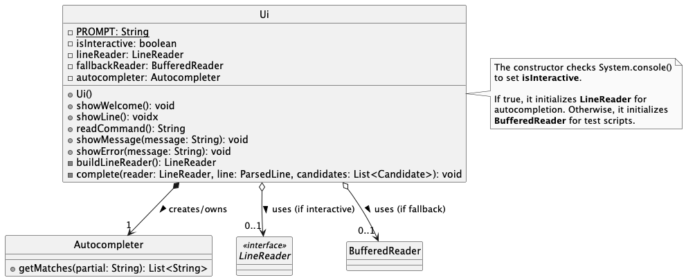
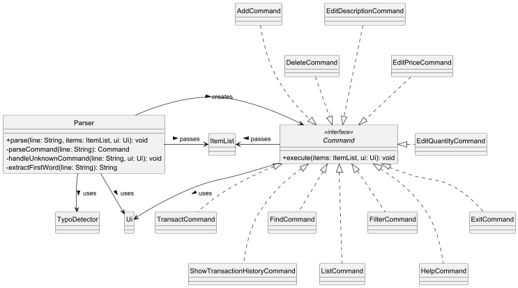
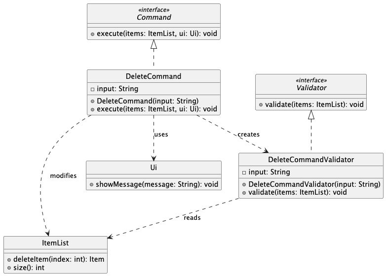
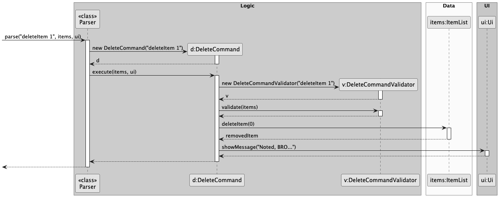
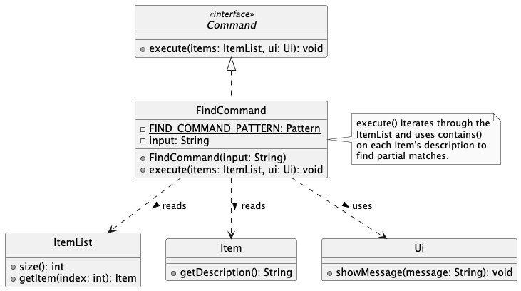
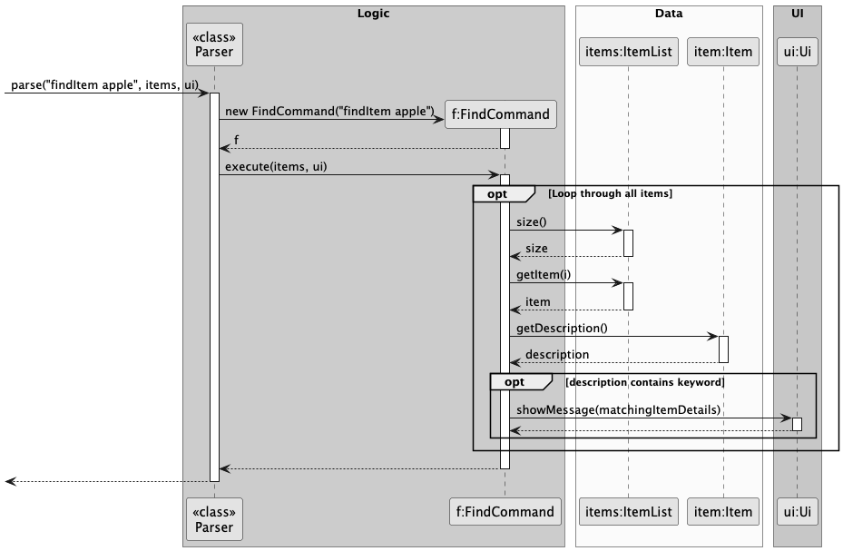

# InventoryBRO - Developer Guide

## Table of Contents
1. [Acknowledgements](#acknowledgements)
2. [Design](#design)
    * [Architecture](#architecture)
    * [UI Component](#ui-component)
    * [Parser Component](#parser-component)
3. [Implementation](#implementation)
    * [Deleting an Item](#deleting-an-item)
    * [Finding an Item](#finding-an-item)
    * [Command Autocompletion (Trie & JLine)](#command-autocompletion)
4. [Proposed/Planned Features](#proposedplanned-features)
    * [Storage & Data Persistence](#storage--data-persistence)

---

## Acknowledgements
* **JLine3**: Used for implementing the interactive terminal, intercepting keystrokes, and providing tab-autocompletion functionality for commands.
* **PlantUML**: Used to generate the UML diagrams in this guide.

---

## Design

### Architecture
The architecture of InventoryBRO strictly adheres to Object-Oriented principles and utilizes the **Command Pattern** to decouple the parsing of user input from the execution of the application's core logic.

The main components are:
* `Ui`: Handles all interactions with the user, including reading inputs and printing formatted messages.
* `Parser`: Interprets the raw string input and instantiates the appropriate `Command` object.
* `Command`: An interface implemented by all executable actions (e.g., `AddCommand`, `DeleteCommand`, `FindCommand`).
* `ItemList` / `Item`: The core data structures representing the inventory state.

### UI Component
The `Ui` class acts as the bridge between the user and the internal logic. It has been engineered to support both interactive human usage and automated testing scripts.

**Figure 1: UI Class Diagram**

**Design highlights:**
* The `Ui` constructor uses `System.console() != null` to determine if the application is running interactively.
* If interactive, it boots up a JLine `LineReader` hooked into an `Autocompleter` to provide real-time tab-completion.
* If automated (e.g., during text-ui-testing), it gracefully falls back to a standard `BufferedReader` to prevent the I/O streams from crashing.

### Parser Component
The `Parser` is responsible for making sense of user input and routing it to the correct command execution flow.

**Figure 2: Parser Class Diagram**

**Design highlights:**
* The `parse()` method acts as a Factory. It extracts the first word of the input string and uses a switch statement to return the corresponding `Command` object.
* If a command is not recognized, it invokes a `TypoDetector` to suggest the closest valid command to the user, enhancing the application's fault tolerance.

---

## Implementation

This section describes some noteworthy details on how certain core features are implemented.

### Deleting an Item
The deletion mechanism is facilitated by the `DeleteCommand` class, which extends the `Command` interface. To adhere strictly to the Single Responsibility Principle (SRP), input validation is decoupled from execution and delegated to a separate `DeleteCommandValidator` class.

**Figure 3: Delete Command Class Diagram**

**Step-by-step Execution:**
1. When the user inputs `deleteItem 1`, the `Parser` instantiates a new `DeleteCommand` with the raw input string.
2. The `Parser` invokes the `execute(items, ui)` method on the `DeleteCommand`.
3. The `DeleteCommand` immediately creates a `DeleteCommandValidator` and calls `validate(items)`.
4. The `DeleteCommandValidator` uses Regex (`^deleteItem\s+(\d+)$`) to ensure the format is correct. If the format is invalid or the parsed index is out of bounds, it throws an `IllegalArgumentException` which halts execution.
5. If validation passes, `DeleteCommand` calculates the zero-based index and calls `deleteItem()` on the `ItemList`.
6. Finally, a success message containing the removed item's details is passed to the `Ui` to be displayed to the user.

**Figure 4: Delete Command Sequence Diagram**

### Finding an Item
The find mechanism is facilitated by the `FindCommand` class, which implements the `Command` interface. It allows users to search for items using partial, case-insensitive string matching.

**Figure 5: Find Command Class Diagram**

**Step-by-step Execution:**
1. When the user inputs `findItem keyword`, the `Parser` instantiates a new `FindCommand`.
2. The `Parser` calls `execute(items, ui)` on the command.
3. The `FindCommand` uses a Regex pattern (`^findItem\s+(.+)$`) to extract the search keyword. If the format is invalid, it throws an `IllegalArgumentException`.
4. The command iterates through the `ItemList`, retrieving each `Item` and checking if its description contains the target keyword.
5. Matching items are immediately passed to the `Ui` to be displayed. If no items match by the end of the loop, a "not found" message is displayed instead.

**Figure 6: Find Command Sequence Diagram**

### Command Autocompletion
To enhance user experience, InventoryBRO features a robust autocompletion engine that allows users to press `Tab` to complete command names.

**Implementation Details:**
* **Data Structure:** The keywords are stored in a custom-built **Trie (Prefix Tree)** data structure (`Trie.java` and `TrieNode.java`). This allows for highly efficient search times compared to iterating through a standard list.
* **Case-Insensitivity:** The Trie is navigated using `.toLowerCase()` characters, but the terminal nodes store the original camelCase keywords (e.g., `addItem`). This ensures that typing `addi` + `Tab` perfectly resolves to `addItem`.
* **Integration:** The `Autocompleter` facade provides a clean API `getMatches(String partial)` which is called by the JLine `completer` in the `Ui` class only when the user is typing the very first word of the prompt (`line.wordIndex() == 0`).

---

## Proposed/Planned Features
